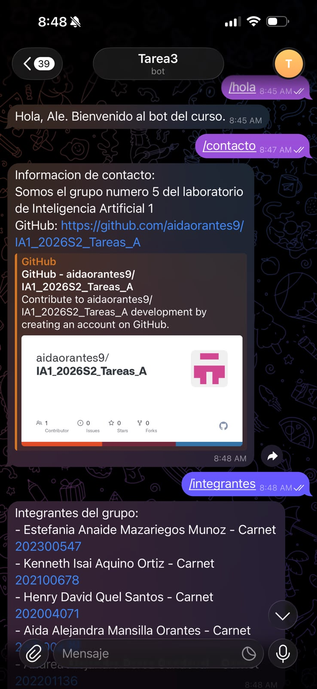
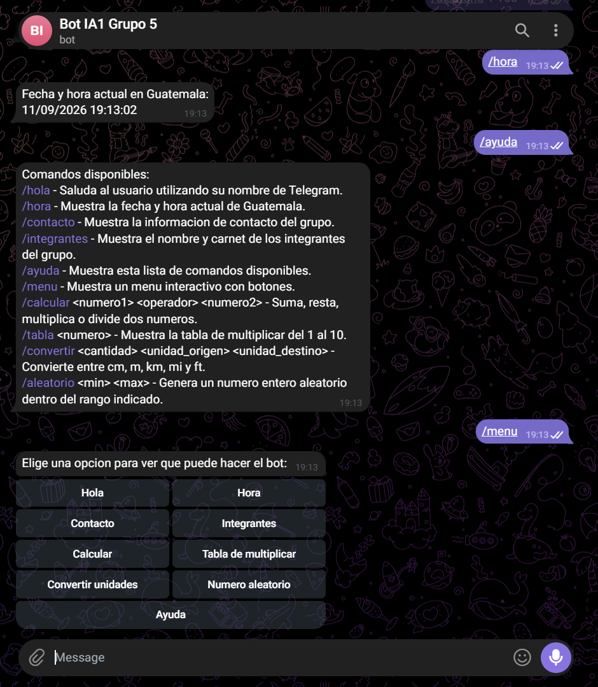
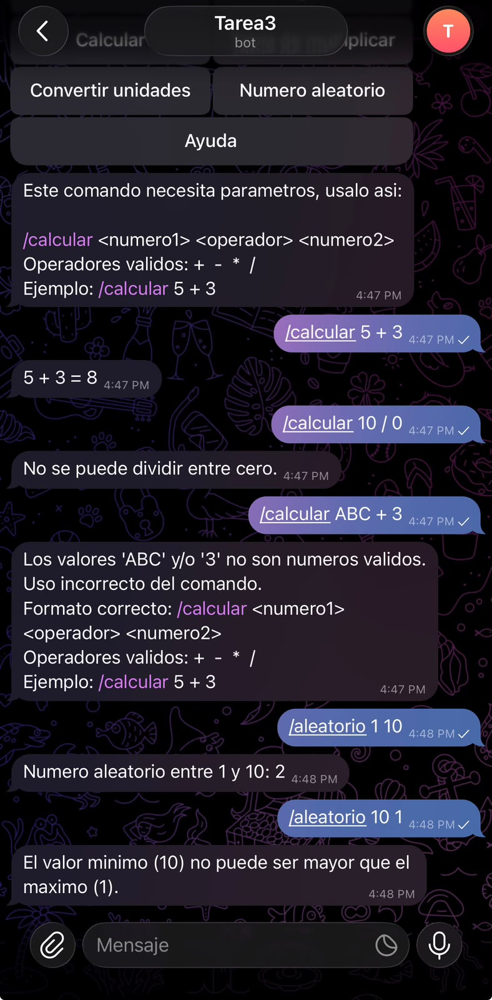
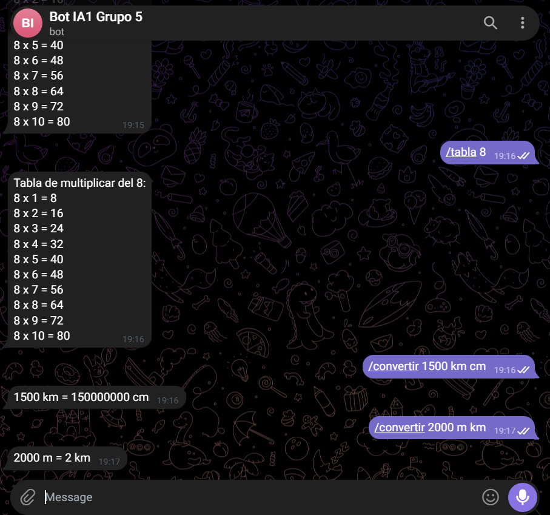

# Tarea 3 – Bot de Telegram

Bot de Telegram interactivo desarrollado en Python para el curso de Inteligencia
Artificial 1, utilizando la librería `python-telegram-bot` y variables de entorno
para proteger el token.

## Integrantes

| Nombre                              | Carnet     | Parte del proyecto |
| ------------------------------------ | ---------- | ------------------- |
| Aida Alejandra Mansilla Orantes      | 202100239  | Persona 1            |
| Kenneth Isai Aquino Ortiz            | 202100678  | Persona 2            |
| Estefania Anaide Mazariegos Muñoz    | 202300547  | Persona 3            |
| Henry David Quel Santos              | 202004071  | Persona 4            |
| Andrea Alejandra Perez Sandoval      | 202201136  | Persona 5            |

## Descripción del bot

El bot responde a comandos de Telegram que permiten: saludar al usuario, mostrar información de contacto y del grupo, consultar la fecha y hora actual, realizar operaciones matemáticas, generar números aleatorios, mostrar tablas de multiplicar, convertir unidades de longitud y navegar un menú interactivo con botones. Además, maneja correctamente comandos inexistentes y parámetros inválidos sin detenerse.

## Requisitos previos

- Python 3.10 o superior
- Una cuenta de Telegram
- Un bot creado con [@BotFather](https://t.me/BotFather) (ver sección de despliegue)

## Instalación y ejecución local

1. Clonar el repositorio y entrar a la carpeta `Tarea3`:

   ```bash
   git clone https://github.com/aidaorantes9/IA1_2026S2_Tareas_A.git
   cd IA1_2026S2_Tareas_A/Tarea3
   ```

2. Crear y activar un entorno virtual:

   ```bash
   python -m venv venv
   venv\Scripts\activate      # Windows
   source venv/bin/activate   # Linux / Mac
   ```

3. Instalar las dependencias:

   ```bash
   pip install -r requirements.txt
   ```

4. Copiar `.env.example` a `.env` y colocar el token real (nunca subir `.env` a GitHub):

   ```bash
   cp .env.example .env
   ```

   ```
   TELEGRAM_TOKEN=tu_token_de_botfather
   ```

5. Ejecutar el bot:

   ```bash
   python bot.py
   ```

## Comandos implementados

| Comando                                              | Descripción                                                        |
| ----------------------------------------------------- | -------------------------------------------------------------------- |
| `/hola`                                               | Saluda al usuario usando su nombre de Telegram.                      |
| `/contacto`                                           | Muestra la información de contacto del grupo.                        |
| `/integrantes`                                        | Muestra el nombre y carnet de los integrantes.                       |
| `/hora`                                               | Muestra la fecha y hora actual de forma dinámica.                    |
| `/ayuda`                                              | Muestra la lista de comandos disponibles y su descripción.           |
| `/menu`                                               | Muestra un menú interactivo con botones de Telegram.                 |
| `/calcular <numero1> <operador> <numero2>`           | Realiza suma, resta, multiplicación o división, validando la entrada. |
| `/tabla <numero>`                                     | Muestra la tabla de multiplicar del 1 al 10.                         |
| `/convertir <cantidad> <unidad_origen> <unidad_destino>` | Convierte entre cm, m, km, mi y ft.                                |
| `/aleatorio <min> <max>`                              | Genera un número entero aleatorio dentro del rango indicado.         |

Cualquier comando no reconocido, o llamado con parámetros inválidos o faltantes, responde con un mensaje de error indicando el uso correcto.


## Evidencia de funcionamiento

Demostración de cada comando funcionando correctamente.






## Grupo de Telegram para pruebas

Link del grupo/canal: https://t.me/+nDHQyqztSSw5ZWIx

## Despliegue en Render (plan gratuito)

El plan gratuito de Render duerme los "Web Services" tras 15 minutos sin recibir
peticiones HTTP. Como el bot usa *polling* (no recibe peticiones HTTP), se agregó
`keep_alive.py`: un servidor Flask mínimo que responde en `/`, para que un
servicio externo lo mantenga despierto.

Pasos:

1. Crear el bot en Telegram hablando con [@BotFather](https://t.me/BotFather): `/newbot` -> seguir las instrucciones -> copiar el `TELEGRAM_TOKEN` generado.
2. En [Render](https://render.com), crear un nuevo **Web Service** apuntando a este repositorio y a la carpeta `Tarea3`.
3. Configurar:
   - **Build Command:** `pip install -r requirements.txt`
   - **Start Command:** `python bot.py`
   - **Environment Variable:** `TELEGRAM_TOKEN` = el token de BotFather
4. Desplegar. Render asigna automáticamente la variable `PORT`, que `keep_alive.py` usa para levantar el servidor de salud.
6. Crear una cuenta gratuita en [UptimeRobot](https://uptimerobot.com) y configurar un monitor HTTP(s) que haga ping a la URL pública del servicio de Render cada 10-14 minutos, para evitar que se duerma por inactividad.

Con esto el bot permanece activo sin necesidad de pagar ningún plan, y se puede pausar manualmente desde el dashboard de Render cuando ya no se necesite.

## Detalle de quién hizo qué

| Persona                | Responsabilidad                                                        | Archivos                          |
| ------------------------ | ------------------------------------------------------------------------ | ---------------------------------- |
| Aida Mansilla (Persona 1) | `/hola`, `/contacto`, `/integrantes`, estructura inicial del proyecto    | `commands.py`   |
| Kenneth Aquino (Persona 2) | `/hora`, `/ayuda`, `/menu` (menú interactivo)                            | `commands.py`, `menu.py` |
| Estefania Mazariegos (Persona 3) | `/calcular`, `/aleatorio`, manejo de errores general                     | `commands.py`, `bot.py` (manejador de errores) |
| Henry Quel (Persona 4)    | `/tabla`, `/convertir`                                                   | `commands.py` |
| Andrea Perez (Persona 5)  | Despliegue en la nube, grupo de Telegram, integración final, `README.md` | `bot.py`, `keep_alive.py`, `README.md` |
